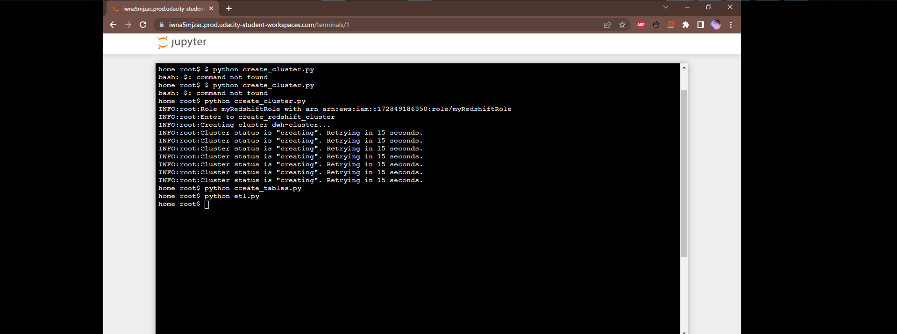
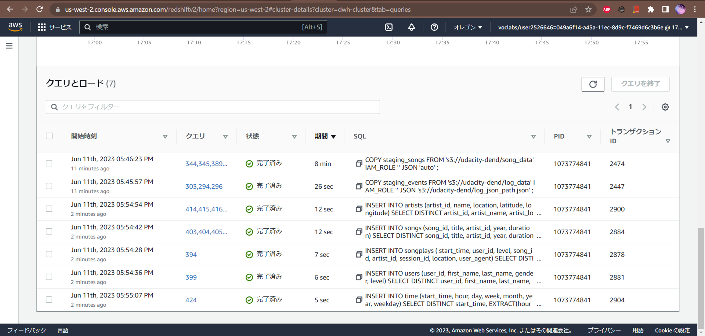

# Project: Data Warehouse

Project submission for Udacity Data Engineering Nanodegree - Data Warehouse

## Introduction
A music streaming startup, Sparkify, has grown their user base and song database and want to move their processes and data onto the cloud. Their data resides in S3, in a directory of JSON logs on user activity on the app, as well as a directory with JSON metadata on the songs in their app.

As their data engineer, you are tasked with building an ETL pipeline that extracts their data from S3, stages them in Redshift, and transforms data into a set of dimensional tables for their analytics team to continue finding insights into what songs their users are listening to.

## Files

**`create_cluster.py`**
* Create Redshift cluster, and allow TCP connection from outside VPC
* Pass `--delete` flag to delete resources

**`create_tables.py`** Drop and recreate tables

**`dwh.cfg`** Configure Redshift cluster and data import

**`etl.py`** Copy data to staging tables and insert into star schema fact and dimension tables

**`sql_queries.py`**
* Creating and dropping staging and star schema tables
* Copy JSON data from S3 to Redshift staging tables
* Insert data from staging tables to star schema fact and dimension tables

## Run scripts

Set environment variables `AWS_ACCESS_KEY_ID` and `AWS_SECRET_ACCESS_KEY`.

Choose `IAM role, DB/DB_PASSWORD` in `dhw.cfg`.

Create Redshift cluster, and configure open TCP connectivity by add redshift_security_group
```bash
$ python create_cluster.py
```

Complete `dwh.cfg` with outputs from `create_cluster.py`
* `CLUSTER/HOST`

Drop and recreate tables
```bash
$ python create_tables.py
```

Run ETL pipeline
```bash
$ python etl.py
```




Delete Redshift cluster
```bash
$ python create_cluster.py --delete
```
